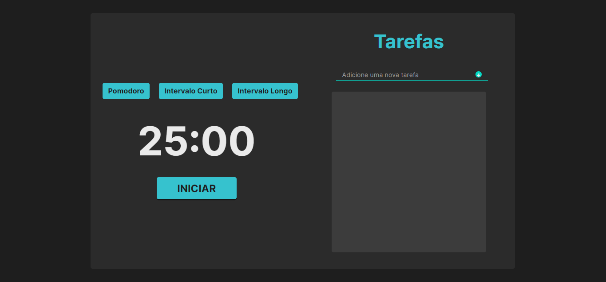

[HTML__BADGE]: https://img.shields.io/badge/Html-000?style=for-the-badge&logo=html
[JAVASCRIPT__BADGE]: https://img.shields.io/badge/Javascript-000?style=for-the-badge&logo=javascript
[CSS__BADGE]:https://img.shields.io/badge/Css-000?style=for-the-badge&logo=css
[PROJECT__BADGE]: https://img.shields.io/badge/📱Visit_this_project-000?style=for-the-badge&logo=project
[PROJECT__URL]:https://github.com/Patrick-1810/my-portifolio

<h1 align="center" style="font-weight: bold;">Pomodoro Timer 💻</h1>


![html][HTML__BADGE]
![css][CSS__BADGE]
![javascript][JAVASCRIPT__BADGE]

<p align="center">
 <a href="#about">About</a> • 
 <a href="#started">Getting Started</a> • 
 <a href="#colab">Develop</a> •
 
</p>


<p align="center">
    
</p>

<h2 id="started">📌 About</h2>

This Pomodoro Timer is a productivity tool designed to help manage work sessions and breaks efficiently. It offers customizable timers for work (25 minutes), short breaks (5 minutes), and long breaks (15 minutes), accompanied by relaxing background music. When the timer ends, an alarm sound plays to signal the end of the session, ensuring you stay focused on your tasks.

[![project][PROJECT__BADGE]][PROJECT__URL]

<h2 id="started">🚀 How to run this project?</h2>

First steps to run the project on your machine

<h3>Prerequisites</h3>

Install or have installed the following requirements

- [Git 2](https://git-scm.com/book/pt-br/v2/Come%C3%A7ando-Instalando-o-Git)

<h3>Cloning</h3>

How to clone your project

```bash
git clone https://github.com/Patrick-1810/pomodoro-timer
```

<h3>Starting</h3>

How to start your project

```bash
cd pomodoro-timer
npm run dev
```


<h2 id="colab">🤝 Developer</h2>

<table>
  <tr>
    <td align="center">
      <a href="#">
        <br>
        <sub>
          <b>Patrick Prestes</b>
        </sub>
      </a>
    </td>
<table>

